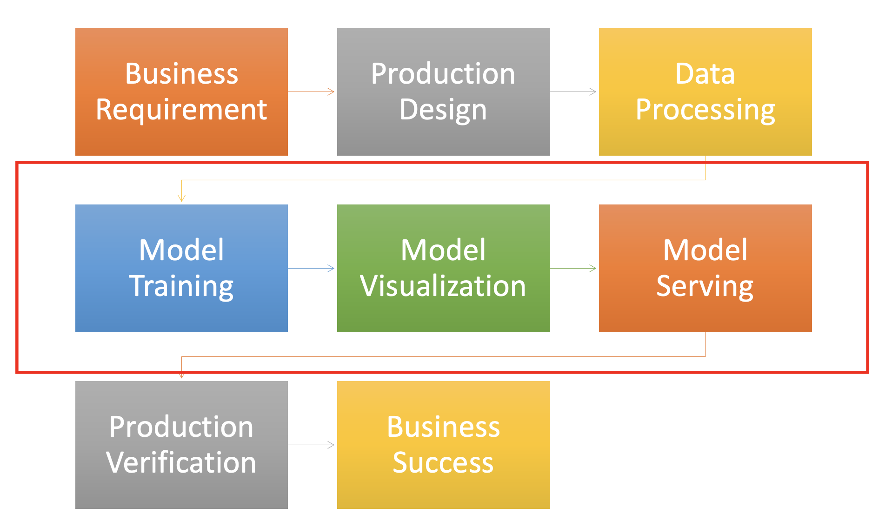
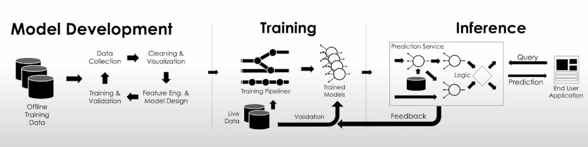

# Machine-Learning in action

this is a [ML](./day-day-up/ml-concepts.md) Journey.

jupyter reference: https://github.com/hdouhua/pick-up-python

## toolchain of python programming and machine learning

### python env

a lot of tools can make it, i like `pyenv`

install pyenv

```shell
curl https://pyenv.run | bash

# or install by pip
pip install pyenv
```

after installed add PATH to `.bashrc` or `.zshrc`

```shell
export PYENV_ROOT="$HOME/.pyenv"
command -v pyenv >/dev/null || export PATH="$PYENV_ROOT/bin:$PATH"
eval "$(pyenv init -)"

# init pyenv automatically
#eval "$(pyenv virtualenv-init -)"

# Restart shell (so the pyenv path changes take effect)
exec $SHELL
```

list all supported pytnon above 3.1x in pyenv

```shell
pyenv install --list | grep " 3\.1\d"
pyenv install -v 3.11.0
```

useful pyenv commands reference

```shell
pyenv commands
pyenv versions

# get where the python / pip is installed
pyenv which python
pyenv which pip

# create virtual python env
pyenv virtualenv <python_version> <environment_name>

# set local python env
pyenv local <environment_name>

pyenv activate <environment_name>
pyenv deactivate

# uninstall/delete virtualenv
pyenv uninstall <environment_name>
# or
pyenv virtualenv-delete <environment_name>
```

for more, please refer to [doc](https://github.com/pyenv/pyenv) or [Managing Multiple Python Versions With pyenv](https://realpython.com/intro-to-pyenv).

### code format / style

there are also a lot of tools for it, for example, `autopep8`, `yapf`, `black`.

- install yapf

   ```shell
   pip install yapf
   ```

- create and edit `.style.yapf` file, the setting is key=value pair

   please refer to [.style.yapf](./ml-model-serving/.style.yapf.bak).

   can also use [`pyproject.toml`](./ml-model-serving/pyproject.toml) for setting.

- run command

   ```shell
   # run code format recursively and write back to file
   yapf --in-place --recursive app/
   ```

for more, please refer to [doc](https://github.com/google/yapf).

### linter - static analysis

linters are programs that advise about code quality by displaying warnings and errors.

there are many tools for it, the most famous are `pylint`, `flake8` and `pyflakes`.

uses `pylint` as an example

install

```shell
pip install pylint isort
```
>`isort` is a Python utility / library to sort imports alphabetically, and automatically separated into sections and by type.

create and edit the file `pylintrc`, please refer to [root's settings](./.pylintrc), or set it by the file [`pyproject.toml`](./ml-model-serving/pyproject.toml).

run lint

```shell
pylint --recursive=y --jobs=2 --output-format=colorized app
```

run isort to sort import

```shell
isort app tests
```

fix code issues according linter's output.


here, highlight some additional info for pylint,

message control - corresponding category of the checks

- C convention related checks
- R refactoring related checks
- W various warnings
- E errors, for probable bugs in the code
- F fatal, if an error occurred which prevented pylint from doing further processing.

more pylint reference,
- [Command line options](https://pylint.pycqa.org/en/latest/user_guide/usage/run.html#command-line-options)
- [checkers reference](https://pylint.pycqa.org/en/latest/user_guide/checkers/features.html)

other enhancement tools, such as [`mypy`](https://mypy.readthedocs.io/en/stable/index.html) is a static type checker and [`bandit`](https://bandit.readthedocs.io/en/latest/start.html) is a tool designed to find common security issues.

### test

install

```shell
pip install pytest pytest-cov
```
>[`pytest-cov`](https://pytest-cov.readthedocs.io/en/latest/readme.html) is a plugin of pytest for code coverage 

write some test cases under the folder tests, please refer to [test cases](./ml-model-serving/tests/test_model_file.py)

run test cases

```shell
pytest <test_case_folder_or_file>
# show verbose
pytest <test_case_folder_or_file> -s --verbose
```

run test with test coverage

```shell
pytest --cov-report html --cov <source_module1> --cov <source_module2> <test_case_folder_or_file>
```
>multiple option `--cov` for cover multiple source code folders, because `pytest-cov` don't support recursive folder (except for python modules with the file `__init__.py`).  
>if you'd like to automatically run pytest code coverage in recursive, please refer to [Makefile](./ml-model-serving/Makefile).

### benchmark

[pytest-benchmark](https://pytest-benchmark.readthedocs.io/en/latest/) or [time.timeit](https://docs.python.org/3/library/timeit.html)

```python
import timeit
from functools import partial
from numpy import percentile

def get_run_time(func, *args):
    repeat = 3
    number = 200
    return percentile(timeit.Timer(partial(func, *args)).repeat(repeat=repeat, number=number), 90) / number
```

### pack - source/module distribution

there are many tools for it, such as tradditional tools `build` or `setuptools` as packaging tools, [`twine`](https://twine.readthedocs.io/en/stable/) for uploading distributions to [PyPI](https://pypi.org/) (please refer to [Packaging tool recommendations](https://packaging.python.org/en/latest/guides/tool-recommendations/#packaging-tool-recommendations)), in new way build with some easier tools [`hatch`](https://hatch.pypa.io/latest/intro/) and [`flit`](https://flit.pypa.io/en/stable/).

in this case, use `build` with setuptools as an example,

install

```shell
pip install build
```

configure package in the file `pyproject.toml` or `setup.cfg`, please refer to [doc](https://setuptools.pypa.io/en/latest/userguide/quickstart.html).
>more reference  
>- [Packaging and distributing projects](https://packaging.python.org/en/latest/guides/distributing-packages-using-setuptools/)
>- [sample code of setuptools](https://github.com/pypa/sampleproject/blob/main/setup.py)

pack source/module - build a wheel and a sdist (tarball)

```shell
python -m build --sdist --outdir build
python setup.py sdist -o build
python -m build --wheel -o build
```

install local file

```shell
pip install <file_path_to_wheel>
```

or install package for local testing (development mode)

```shell
# run setup.py
python -m pip install -e .
pip install -e
```

publish package to PyPI ...

## flow of machine learning

one of classic ML workflow



one of ML lifecyle



## reference & further reading

PEP stands for Python Enhancement Proposal

- [PEP 8 – Style Guide for Python Code](https://peps.python.org/pep-0008/)
- [Python Packaging User Guide](https://packaging.python.org/en/latest/key_projects/)
- [How to Set Up a Python Project For Automation and Collaboration](https://eugeneyan.com/writing/setting-up-python-project-for-automation-and-collaboration/)
- [A pyproject.toml Developer’s Cheat Sheet](https://betterprogramming.pub/a-pyproject-toml-developers-cheat-sheet-5782801fb3ed)
- [Awesome pyproject.toml](https://github.com/vinta/awesome-python)
- [Advanced Visual Studio Code for Python Developers](https://realpython.com/advanced-visual-studio-code-python/)
- [](https://scikit-hep.org/developer/pep621)
- [](https://henryiii.github.io/level-up-your-python/notebooks/0%20Intro.html)
