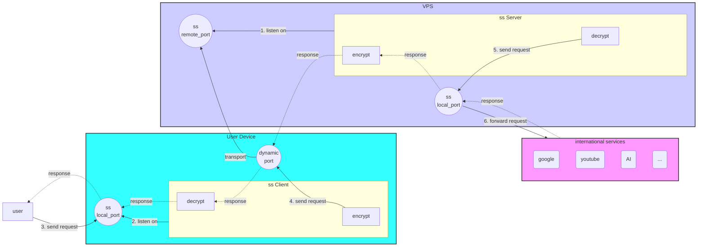
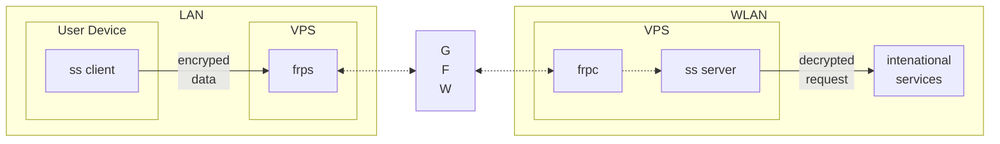

# GFW

## SS 

### 工作原理



### 配置

server 配置

```json
{
    "server":["[::0]","0.0.0.0"],// 同时支持 Ipv6 和 Ipv4
    "server_port":8388,
    "local_port":1080,
    "timeout": 600, # 超时毫秒数
    "method":"chacha20-ietf-poly1305",
    "password":"barfoo!"
}
```

多用户配置

```json
{
    "server": ["[::0]","0.0.0.0"],
    "server_port":8388,
    "local_port": 1080,
    "timeout": 600,
    "method": "chacha20-ietf-poly1305",
    "port_password": {
        "8388": "barfoo!", # 端口号与密码
        "8389": "barfoo#" 
    }
}
```

client 配置

```json
{
  "server": "server_ip_or_domain",
  "server_port": 8388,
  "local_address": "127.0.0.1",
  "local_port": 1080,
  "password": "barfoo!",
  "timeout": 300,
  "method": "chacha20-ietf-poly1305",
  "fast_open": false  // whether to enable TCP fast open
}
```

服务器端防火墙

```shell
sudo iptables -A INPUT -i eth0 -p tcp --dport 8388 -j ACCEPT
sudo iptables -A INPUT -i eth0 -p udp --dport 8388 -j ACCEPT
```

客户端防火墙

```shell
sudo iptables -A OUTPUT -o eth0 -p tcp --sport 8388 -j ACCEPT
sudo iptables -A OUTPUT -o eth0 -p udp --sport 8388 -j ACCEPT

sudo iptables-save > /etc/iptables/rules.v4
firewall-cmd --complete-reload
```

service

```ini
[Unit]
Description=shadowsocks manager
After=network.target

[Service]
Type=forking
ExecStart=/usr/local/bin/ss-manager \
    --manager-address /var/run/shadowsocks-manager.sock \
    -c /etc/shadowsocks/ss_manager.json
PrivateTmp=true # 使用私有临时文件目录

[Install]
WantedBy=multi-user.target
```

使用iptables 统计各端口流量

出网流量

```shell
iptables -A OUTPUT -p tcp --sport 8388
-A OUTPUT    表示在 OUTPUT 上增加一条规则
-D OUTPUT    表示在 OUTPUT 上删除一条规则
-p tcp       表示指定tcp协议
–sport 8388  表示出网的端口号为 8388
```

入网流量

```shell
iptables -A INPUT -p tcp --dport 8388
-A INPUT     表示在 INPUT 上增加一条规则
-D INPUT     表示在 INPUT 上删除一条规则
-p tcp       表示指定 tcp 协议
–dport 8388  表示入网的端口号为 8388
```

查看流量信息

```shell
iptables -vnL
iptables -vnL>/home/iptables.log
iptables -n -v -L -t filter -x # 以字节方式显示
```

流量信息自添加规则之后开始统计，无法显示之前的流量信息。重启防火墙，流量统计数据将会被重置。

## frps



## 

- [](https://wgetcloud.org/)
- [](https://dog.ssrdog.com/)
- 