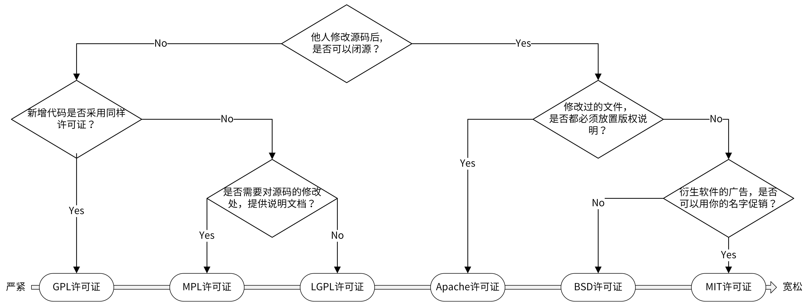

# 规范设计

软件开发流程


软件开发中的规范

| 非编码规范  | 编码规范   |
| ----------- | ---------- |
| 开源规范    | 目录规范   |
| 文档规范    | 代码规范   |
| 版本规范    | 接口规范   |
| commit 规范 | 日志规范   |
| 发布规范    | 错误码规范 |

## 开源规范

https://github.com/marmotedu/geekbang-go/blob/master/%E5%BC%80%E6%BA%90%E8%A7%84%E8%8C%83%E8%AF%A6%E7%BB%86%E5%88%97%E8%A1%A8.md

### 开源协议



## 文档规范

- 项目文档 ： 放 docs 下
   - 开发文档
   - 用户文档
- API 接口规范文档

## 版本规范

### 语义版本

```
主版本号.次版本号.修订版本号-先行版本号+编译版本号
1.0.0-alpha+001
1.0.0+20130313144700
1.0.0-beta+exp.sha.5114f85
```

### 如何确定版本号

- 开发阶段从 0.1.0 开始 后面每次发布时递增次版本号
- 稳定时对外第一次发布时，版本号可定为 1.0.0
- 如果按照 Angular commit message 规范提交代码，那么版本号可以如下确定
   - fix 类型 commit ：修订版本号 + 1
   - feat 类型 commit ：次版本号 + 1
   - 带有 BREAKING CHANGE 的 commit ： 主版本号 +1

## commit message 规范

一个好的 Commit Message 规范可以使可读性更好，并且可以实现自动化。

- 可以让开发人员清楚地知道每个 commit 的变更内容，方便查阅历史。
- 方便进行过滤查找 `git log --oneline --grep "^feat|^fix"`
- 可以基于规范的 commit message 生成 change log
- 可以对某些类型 commit message 触发构建或者发布流程，比如 type = feat | fix 时才触发 CI
- 可以用于确定语义版本号，比如 
   - type = fix ： PATCH 版本
   - type = feat ： MINOR 版本
   - 带有 BREAKING CHANGE ： MAJOR 版本
  
社区里有多种 commit message 规范，在这些规范中， Angular 规范在功能上能够满足开发者 commit 需求，在格式上清晰易读，也是目前用得最多的。

Angular 规范是一种语义化的提交规范（Semantic Commit Messages），每一条 Commit Message 都会被归为一个有意义的类型，用来说明本次 commit 的类型；每一条 Commit Message 格式固定，不仅可被开发者识别也可以被工具识别。

Angular 规范的 Commit Message 格式如下：

```
<type>[optional scope]: <short summary>
// 空行
[optional body]
// 空行
[optional footer(s)]
```

它包含三个部分
- Header ：是必需的。`<scope>` 必须用括号 `()` 括起来， `<type>[<scope>]` 后必须紧跟冒号，之后必须紧跟空格。
- Body ：是可选的。前后的 2 个空行是必需的。
- Footer ：是可选的。

更多细节参考 https://www.conventionalcommits.org/zh-hans/v1.0.0/

### Header 部分的说明

```
<type>(<scope>): <subject>
  │       │             │
  │       │             └─⫸ Summary in present tense. Not capitalized. No period at the end.
  │       │
  │       └─⫸ Commit Scope: animations|bazel|benchpress|common|compiler|compiler-cli|core|
  │                          elements|forms|http|language-service|localize|platform-browser|
  │                          platform-browser-dynamic|platform-server|router|service-worker|
  │                          upgrade|zone.js|packaging|changelog|docs-infra|migrations|ngcc|ve|
  │                          devtools
  │
  └─⫸ Commit Type: build|ci|docs|feat|fix|perf|refactor|test
```

- type

   它用来说明 commit 的类型。对类型做个归纳，可以归为 Development 和 Production 两类。
   - 对于 Development 类一般是项目管理类的变更，一般可以免测试发布。
   - 对于 Production 类一般是会影响生产环境的变更，提交前需要充分测试，需要认真做 CR （code review）

   

   如何确定一个 commit 所属的 type ？

   

   可以扩展添加自己的 type，但尽可能确保一个项目中的 type 类型一致。

- scope

   它用来说明 commit 的影响范围的，它必须是名词。
   可以根据组件名和功能来设置。

- subject

   在实际开发中，为了使 Commit Message 更加易读，会限制每行 message 的长度。根据需要，可以限制为 50/72/100 个字符。

### Body 部分

本次 commit 具体做了哪些变更呢？就是通过 Body 部分详细描述的。
Body 部分可以分成多行，而且格式也比较自由。

### Footer 部分

主要用来说明本次 commit 导致的后果。
在实际应用中，Footer 通常用来说明不兼容的改动和关闭的 Issue 列表。

### 代码 commit 频率

什么时候 commit ，两种情况：
1. 只要对项目进行了修改，一通过测试就立即 commit。比如修复完一个 bug、开发完一个小功能，或者开发完一个完整的功能，测试通过后就提交。
2. 定期提交。建议下班前固定提交一次，并且要确保本地未提交的代码，延期不超过 1 天。可以尽可能减少发生意外时丢失的代码量。

如果觉得代码 commit 比较多，看起来比较随意。可以在最后 merge 或者提交 Pull Request 前，执行 `git rebase -i` 合并之前的所有 commit 。

### 合并提交

参考 git 用法。

### Commit Message 规范自动化

Commit Message 规范如果靠文档去约束，就会严重依赖开发者的代码素养，并不能真正保证提交的 commit 是符合规范的。
可以通过一些工具，来自动化这个流程。

这个工具可以
- 辅助生成符合 Angular 规范的 Commit Message 
- Commit Message 提交前检查
- 历史 Commit Message 检查
- 基于 Commit Message 自动生成 CHANGELOG 和 SemVer

工具列表

- commitizen-go：使你进入交互模式，并根据提示生成 Commit Message，然后提交。
- commit-msg：githooks，在 commit-msg 中，指定检查的规则，commit-msg 是个脚本，可以根据需要自己写脚本实现。这门课的 commit-msg 调用了 go-gitlint 来进行检查。
- go-gitlint：检查历史提交的 Commit Message 是否符合 Angular 规范，可以将该工具添加在 CI 流程中，确保 Commit Message 都是符合规范的。
- gsemver：语义化版本自动生成工具。
- git-chglog：根据 Commit Message 生成 CHANGELOG。

安装 git-chglog

```shell
go install github.com/git-chglog/git-chglog/cmd/git-chglog@latest
```

初始化 git-chglog 

```shell
➜ git-chglog --init
? What is the URL of your repository? https://gh-douhua/hdouhua/hello-go
? What is your favorite style? github
? Choose the format of your favorite commit message <type>(<scope>): <subject>
? What is your favorite template style? cool
? Do you include Merge Commit in CHANGELOG? Yes
? Do you include Revert Commit in CHANGELOG? Yes
? In which directory do you output configuration files and templates? .chglog

✨  Configuration file and template generation completed!
  ✔ .chglog/config.yml
  ✔ .chglog/CHANGELOG.tpl.md
```

创建 tag

```
git tag -a v0.1.0 -m "test change log"
```

生成 CHANGELOG.md

```
git-chglog -o CHANGELOG.md
⌚  Generating changelog ...
✨  Generate of "CHANGELOG.md" is completed! (41.469625ms)
```

## 目录规范


### 平铺式目录结构

一个 Go 项目可以是一个应用，也可以是一个代码框架 / 库，当项目是代码框架 / 库时，比较适合采用平铺式目录结构。

比如 github.com/golang/glog

### 结构化目录结构

当前 Go 社区比较推荐的结构化目录结构是 [project-layout](https://github.com/golang-standards/project-layout)。虽然它并不是官方和社区的规范，但因为组织方式比较合理，而被众多 Go 开发人员接受。

一个 Go 项目包含 3 大部分：Go 应用 、项目管理和文档。


1. /web

   前端代码存放目录，主要用来存放 Web 静态资源，服务端模板和单页应用（SPAs）。

1. /cmd
   
   一个项目有很多组件，可以把组件 main 函数所在的文件夹统一放在/cmd 目录下。如 /cmd/<组件名>/main.go

1. /internal
   
   存放私有应用和库代码。
   需要注意引入其它项目 internal 下的包时，Go 语言会在编译时报错，如下。也就是可以通过 Go 语言本身的机制来约束其他项目 import 项目内部的包。

   ```
   An import of a path containing the element “internal” is disallowed
   if the importing code is outside the tree rooted at the parent of the
   "internal" directory.
   ```

   举例，
   /internal/apiserver ：存放应用 apiserver 的代码
   /internal/pkg ：内部共享包

1. /pkg
   存放可以被外部应用使用的代码库，其他项目可以直接通过 import 导入这里的代码。

1. /vendor
   go mod vendor 创建的 go 模块依赖包副本。

1. /build
   存放安装包和持续集成相关的文件

2. /test
   用于存放其他外部测试应用和测试数据

3. /docs
   存放设计文档、开发文档和用户文档等

4. /examples
   存放应用程序或者公共包的示例代码

### 不建议目录

- /src
- /xxxs
  避免使用复数的目录名或包名

### 小项目的开始

可以考虑先从仅包含 cmd、pkg、internal 3 个目录开始。

## 工作流设计

- git merge --no-ff
  对应 github Create a merge commit：
  feature 分支上所有的 commit 都会加到 master 分支上，并且会生成一个 merge commit。

- git merge --squash
  对应 github Squash and merge：
  这种方式会将分支上的所有 commit 都合并成一个 commit ，然后加到 master 分支上（原来的 commit 历史会丢失）。

- git rebase
  对应 github Rebase and merge
  这种方式会将分支上的所有提交历史按照原有顺序依次添加到 master 分支的头部（HEAD）。

### 集中式工作流

集中式工作流程的代码管理较混乱，容易出问题，因此适合用在团队人数少、开发不频繁、不需要同时维护多个版本的小项目中。

### 功能分支工作流

在开发新功能时，基于 master 分支新建一个功能分支，在功能分支上进行开发，而不是直接在本地的 master 分支开发，开发完成之后合并到 master 分支。

功能分支工作流上手比较简单，不仅能并行开发多个功能，还可以添加 code review，从而保障代码质量。当然它也有缺点，就是无法给分支分配明确的目的，不利于团队配合。因此它适合用在开发团队相对固定、规模较小的项目中。

### git flow 工作流

Git Flow 中定义了 5 种分支，分别是 master、develop、feature、release 和 hotfix。其中，master 和 develop 为常驻分支，其他为非常驻分支，不同的研发阶段会用到不同的分支。

Git Flow 工作流的每个分支分工明确，这可以最大程度减少它们之间的相互影响。因为可以创建多个分支，所以也可以并行开发多个功能。另外，和功能分支工作流一样，它也可以添加 code review，保障代码质量。

Git Flow 工作流比较适合开发团队相对固定，规模较大的项目。

### forking 工作流

开源项目的主要工作流。

## 开发流程

六个阶段：

1. 需求阶段
   参与产品讨论，详细了解需求
2. 设计阶段
   做好调研，设计具有领先性的技术架构，技术方案要获得团队的一致通过
3. 开发阶段
4. 测试阶段
5. 发布阶段
6. 运营阶段


## 软件生命周期


