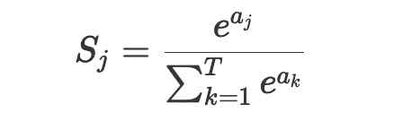
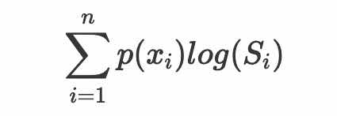
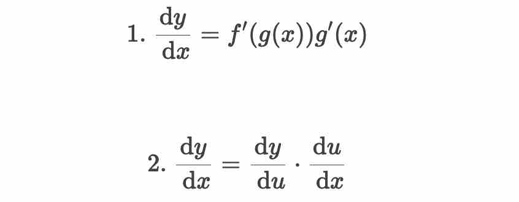

# 损失函数

一个深度学习项目包括了模型的设计、损失函数的设计、梯度更新的方法、模型的保存与加载、模型的训练过程等几个主要模块。


损失函数是一把衡量模型学习效果的尺子，**训练模型的过程，实际就是优化损失函数的过程**。在机器学习中，常常提到的梯度更新和反向传播等内容，都是涉及到损失函数的相关概念。

## 拟合

模型的学习过程，模型最开始的时候就是一张白纸，它什么都不知道。研发人员不断地给模型提供要学习的数据。模型拿到数据之后就要有一个非常重要的环节：把模型自己的判断结果和数据真实的情况做比较。如果偏差或者差异特别大，那么模型就要去纠正自己的判断，用某种方式去减少这种偏差，然后反复这个过程，直到最后模型能够对数据进行正确的判断。
衡量这种偏差的方式很重要，也是模型学习进步的关键所在。减少偏差的过程，被称为拟合过程。

拟合会有过拟合与欠拟合。

## 损失函数与代价函数

假设一个二维空间中，任意一个点对应的真实函数为 F(x)，通过模型的学习拟合出来的函数为 f(x)。 F(x) 和 f(x) 之间存在一个误差，定义为 L(x)，于是有：

`L(x)=(F(x)−f(x))^2`

这里 F(x) 和 f(x) 的差距的平方和，是为了保证两者的误差是一个正值，方便后续的计算。也可以做成绝对值的形式，实践中平方和要比绝对值更为方便。

评价拟合函数表现效果“好坏”的度量指标——`损失函数（loss fuction)`。根据公式可知，损失函数越小，拟合函数对于真实情况的拟合效果就越好。L(x) 就是一种损失函数。（机器学习中损失函数有很多种）

把集合所有的点对应的拟合误差做平均，就会得到如下公式：

`∑​(F(x)−f(x))^2 / N` 

这个函数叫做`代价函数（cost function）`，即在训练样本集合上，所有样本的拟合误差的平均值。代价函数也称作经验风险。

在实际的应用中，并不需要严格区分损失函数和代价函数。只需要知道，损失函数是单个样本点的误差，代价函数是所有样本点的误差。

## 常见损失函数

严格来说，损失函数的种类是无穷多的。作为初学者，推荐从一些常用的损失函数做开始学习。

### 0-1 损失函数

如果模型预测对了，损失函数的值就为 0，因为没有误差；如果模型预测错了，那么损失函数的值就为 1。这就是最简单的 0-1 损失函数。
但是，0-1 损失函数的使用频率是非常少的，因为模型训练中经常用到的梯度更新和反向传播都需要能够求导的损失函数，可是 0-1 损失函数的导数值是 0（常数的导数为 0）。

### 平方损失函数

损失函数的定义时，举例的 L(x)=(F(x)−f(x))^2，这个函数的正式名称叫做平方损失函数。平方损失函数是可求导的损失函数中最简单的一种，它直接度量了模型拟合结果和真实结果之间的距离。

>有时候，会在损失函数中加入一个 1/2 的系数，这是为了求导的时候能够跟平方项的系数约掉。

### 均方差损失函数和平均绝对误差损失函数

`均方误差（Mean Squared Error，MSE）`是回归问题损失函数中最常用的一个，也称作 L2 损失函数。它是预测值与目标值之间差值的平方和。它的定义如下：

MSE=∑​(si​−yip​)^2 / n

其中 s 为目标值的向量表示，y 为预测值的向量表示。​

`平均绝对误差损失函数（Mean Absolute Error, MAE）`是另一种常用于回归问题的损失函数，它的目标是度量真实值和预测值差异的绝对值之和，定义如下：

MAE=∑|yi​−yip|​ / n

### 交叉熵损失函数

熵最开始是物理学中的一个术语，它表示了一个系统的混乱程度或者说无序程度。如果一个系统越混乱，那么它的熵越大。

后来，信息论创始人香农把这个概念引申到信道通信的过程中，开创了信息论，所以这里的熵又称为信息熵。信息熵的公式化可以表示为：

`H§=−∑​p(xi​)logp(xi​)`

其中，x 表示随机变量，与之相对应的是所有可能输出的集合。P(x) 表示输出概率函数。变量的不确定性越大，熵也就越大，把变量搞清楚所需要的信息量也就越大。

将函数变为如下格式，将 log p 改为 log q，即：

`−∑​p(xi​)log(q(xi​))`

其中，𝑝(𝑥) 表示真实概率分布，𝑞(𝑥) 表示预测概率分布。这个函数就是交叉熵损失函数（Cross entropy loss）。这个公式同时衡量了真实概率分布和预测概率分布两方面。通过不断尝试缩小两个概率分布的误差，使预测的概率分布尽可能达到真实概率分布。

### softmax 损失函数

softmax 是深度学习中使用非常频繁的一个函数。在某些场景下，一些数值大小范围分布非常广，而为了方便计算，或者使梯度更好的更新，需要把输入的这些数值映射为 0-1 之间的实数，并且归一化后能够保证几个数的和为 1。它的公式化表示为：



如果把交叉熵损失函数公式中的 q(xi)，也就是预测的概率分布，换成 softmax 方式的表示，即：



就得到了一个成为 softmax 损失函数（softmax loss）的新函数，也称为 softmax with cross-entropy loss，它是交叉熵损失函数的一个特例。

# 计算梯度

模型有了损失函数，才能够进行学习。那么问题来了，模型是如何通过损失函数进行学习的呢？

## 前馈网络

前馈网络，也称为前馈神经网络，是一种“往前走”的神经网络。它是最简单的神经网络，其典型特征是一个单向的多层结构。


最左侧的绿色的一个个神经元，它们相当于第 0 层，一般适用于接收输入数据的层 ——输入层。

比如，要训练一个 y=f(x) 函数的神经网络，x 作为一个向量，就需要通过这个绿色的输入层进入模型。在这个网络中，输入层有 5 个神经元，这意味着它可以接收一个 5 维长度的向量。

网络的中间有一层红色的神经元，它们相当于模型的“内部”，一般来说对外不可见，或者使用者并不关心的非结果部分 ——隐藏层。
在实际的网络模型中，隐藏层会有非常多的层数，它们是网络最为关键的内部核心，也是模型能够学习知识的关键部分。

在图的右侧，蓝色的神经元是网络的最后一层。模型内部计算完成之后，就需要通过这一层输出到外部 ——输出层。

神经元之间的连线，表示神经元之间连接的权重，通过权重就会知道网络中每个节点的重要程度。

在前馈网络中，数据从输入层进入到隐藏层的第一层，然后传播到第二层，第三层……一直到最后通过输出层输出。数据的传播是单向的，无法后退，只能前行。

## 导数、梯度与链式法则

有前向的数据传播，自然也会有反向的数据传播过程。
说到反向传播，常常还会把它与梯度下降、链式法则这些相关联。

### 导数

导数，也叫做导函数值。

以 F=3x 为例，在 x=3 的时候，函数值为 3x=3*3=9。现在给 x 一个非常小的增量Δx，那么就有了 F(x+Δx)=3(x+Δx)，也就是说函数值也有了一个非常小的增量，记为Δy。当函数值增量Δy 与变量 x 的增量Δx 的比值，在Δx 趋近于 0 时，如果极限 a 存在，就称 a 为函数 F(x) 在 x 处的导数。

### 偏导数

有的函数不止一个变量，比如 z=3x+2y 函数中就同时存在了 x 和 y 两种变量，那该怎么求它们的导数呢？这是偏导数的问题。

偏导数其实就是保持一个变量变化，而所有其他变量恒定不变的求导过程。

比如对于函数 z=x^2+y^2，∂x/∂z​=2x 表示函数 z 在 x 上的导数，∂y/∂z​=2y 表示函数 z 在 y 上的导数。

### 梯度

函数所有偏导数构成的向量就叫做梯度。

梯度向量的方向即为函数值增长最快的方向。——这是一个非常重要的结论，它贯穿了整个深度学习的全过程。模型要学习知识，就要用最快最好的方式来完成，其实就是需要借助梯度来进行。

### 链式法则

**深度学习的整个学习过程，其实就是一个更新网络节点之前权重的过程**。这个权重就在前馈网络中示意图中看到的节点之间的连线，一般使用 w 来进行表示它。

模型就是通过*不断地减小损失函数值*的方式来进行学习的。让损失函数最小化，通常就要采用*梯度下降*的方式，即：每一次给模型的权重进行更新的时候，都要按照梯度的反方向（梯度向量的方向即为函数值增长最快的方向，反方向则是减小最快的方向）进行。

**链式法则：“两个函数组合起来的复合函数，导数等于里面函数代入外函数值的导数，乘以里面函数之导数。”**



有函数 f(x)=cos(x2−1)，可以把函数分解为：
1. f(x)=cos(x)
2. g(x)=x^2−1

g(x) 的导数 g′(x)=2x，f(x) 的导数 f′(x)=−sin(x)，则 `f′(x)=f′(g(x)) * g′(x)=−sin(x∧2−1) * 2x`，相当于各自求导后再相乘。

## 反向传播

反向传播算法（Backpropagation）是目前训练神经网络最常用且最有效的算法。模型就是通过反向传播的方式来不断更新自身的参数，从而实现了“学习”知识的过程。

反向传播的主要原理是：
- 前向传播：数据从输入层经过隐藏层最后输出，其过程和之前讲过的前馈网络基本一致。
- 计算误差并传播：计算模型输出结果和真实结果之间的误差，并将这种误差通过某种方式反向传播，即从输出层向隐藏层传递并最后到达输入层。
- 迭代：在反向传播的过程中，根据误差不断地调整模型的参数值，并不断地迭代前面两个步骤，直到达到模型结束训练的条件。

其中最重要的环节有两个：一是通过某种方式反向传播；二是根据误差不断地调整模型的参数值。——统称为优化方法

## 小结

- 模型通过梯度下降的方式，在梯度方向的反方向上不断减小损失函数值，从而进行学习。
- 为了得到最小的损失函数，要用梯度下降的方法使其达到最小值。

# 优化方法

深度学习的三个最重要的核心过程：模型表示、方法评估、优化方法。

*优化方法* 指的是一个过程，
寻找模型在所有可能性中达到评估效果指标最好的那一个；
找到能够使得 f(x) 的值达到最小值对应的权重；
找到那个状态，能够让模型的损失函数最小——这个状态就是模型的权重。

常见的优化方法种类非常多，有梯度下降法、牛顿法、拟牛顿法等，涉及的数学知识也更是不可胜数。同样的，PyTorch 也将优化方法进行了封装，在实际开发中直接使用即可，节省了大量的时间和劳动。

*梯度下降法*是深度学习中使用最为广泛的优化方法。
在一个多维空间中，对于任何一个曲面，都能够找到一个跟它相切的超平面。这个超平面上会有无数个方向，但是这所有的方向中，肯定有一个方向是能够使函数下降最快的方向，这个方向就是梯度的反方向。每次优化的目标就是沿着这个最快下降的方向进行，就叫做梯度下降。

举一个生活化的例子。假期跟朋友去爬山，到了山顶之后忽然想上厕所，需要尽快到达半山腰的卫生间，这时候需要规划路线，该怎么规划呢？


图中红色的线路，是一个看上去还不错的上厕所的路线。也发现，还有别的路线可选。这里就引出一个路线也得讲究方法，比如，步子大小很重要，太大的话可能就按照上图中的黄色路线跑了，最后跑到了别的山谷中（函数的局部极小值而非整体最小值）或者在接近和远离卫生间的来回震荡过程中，结果可想而知。但是如果步伐太小了，则需要的时间就很久，可能还没走到目的地，就坚持不住了（蓝色路线）。

在算法中，这个步子的大小，叫做学习率（learning rate）。因为步长的原因，理论上是不可能精确地走到目的地的，而是最后在最小值的某一个范围内不断地震荡，也会存在一定的误差，不过这个误差是可以接受的。

在实际的开发中，如果损失函数在一段时间内没有什么变化，就认为是到达了需要的“最低点”——模型已经训练收敛了，从而结束训练。

## 常见的梯度下降方法

1. 批量梯度下降法（Batch Gradient Descent，BGD）

   梯度更新的量太大，训练速度慢。

2. 随机梯度下降（Stochastic Gradient Descent，SGD）

   随机梯度下降法的特点是，每计算一个样本之后就要更新一次参数，这样参数更新的频率就变高了。可能只需要训练集中的一部分数据，就可以实现接近于使用全部数据训练的效果，训练速度也大大提升。

   但也会存在一些问题，比如，训练数据中肯定会存在一些错误样本或者噪声数据，那么在一次用到该数据的迭代中，优化的方向肯定不是朝着最理想的方向前进的，也就会导致训练效果（比如准确率）的下降。最极端的情况下，就会导致模型无法得到全局最优，而是陷入到局部最优。

   随机梯度下降方法选择了用损失很小的一部分精确度和增加一定数量的迭代次数为代价，换取了最终总体的优化效率的提高。

3. 小批量梯度下降（Mini-Batch Gradient Descent, MBGD）

   Mini-batch 的方法是目前主流使用最多的一种方式，它每次使用一个固定数量的数据进行优化。

   这个固定数量称它为 batch size。batch size 较为常见的数量一般是 2 的 n 次方，比如 32、128、512 等，越小的 batch size 对应的更新速度就越快，反之则越慢，但是更新速度慢就不容易陷入局部最优。

## 实例

一段伪代码来快速领会思路。先设置好模型、损失函数和优化函数；然后针对每一批（batch）数据，求得输出结果；接着计算损失函数值，再把这个值进行反向传播，并利用优化函数进行优化。

```python
# 假定使用的模型叫做LeNet
import LeNet #首先导入模型的定义类
import torch.optim as optim #引入PyTorch自带的可选优化函数
...
net = LeNet() #声明一个LeNet的实例
criterion = nn.CrossEntropyLoss() #声明模型的损失函数，使用的是交叉熵损失函数
optimizer = optim.SGD(net.parameters(), lr=0.001, momentum=0.9)
# 声明优化函数，使用的就是之前提到的SGD，优化的参数就是LeNet内部的参数，lr即为之前提到的学习率

#下面开始训练
for epoch in range(30): #设置要在全部数据上训练的次数
  
    for i, data in enumerate(traindata):
        #data就是获取的一个batch size大小的数据
  
        inputs, labels = data #分别得到输入的数据及其对应的类别结果
        # 首先要通过zero_grad()函数把梯度清零，不然PyTorch每次计算梯度会累加，不清零的话第二次算的梯度等于第一次加第二次的
        optimizer.zero_grad()
        # 获得模型的输出结果，也即是当前模型学到的效果
        outputs = net(inputs)
        # 获得输出结果和数据真正类别的损失函数
        loss = criterion(outputs, labels)
        # 算完loss之后进行反向梯度传播，这个过程之后梯度会记录在变量中
        loss.backward()
        # 用计算的梯度去做优化
        optimizer.step()
...
```

## 思考

batch size 越大越好吗？

1. batch_size 越大显存占用会越多，可能会造成内存溢出问题
2. batch_size 越大，一次读取太多的样本，可能会造成迭代速度慢的问题
2. batch_size 较大容易使模型收敛在局部最优点
3. batch_size 过大，可能会导致模型泛化能力较差的问题
